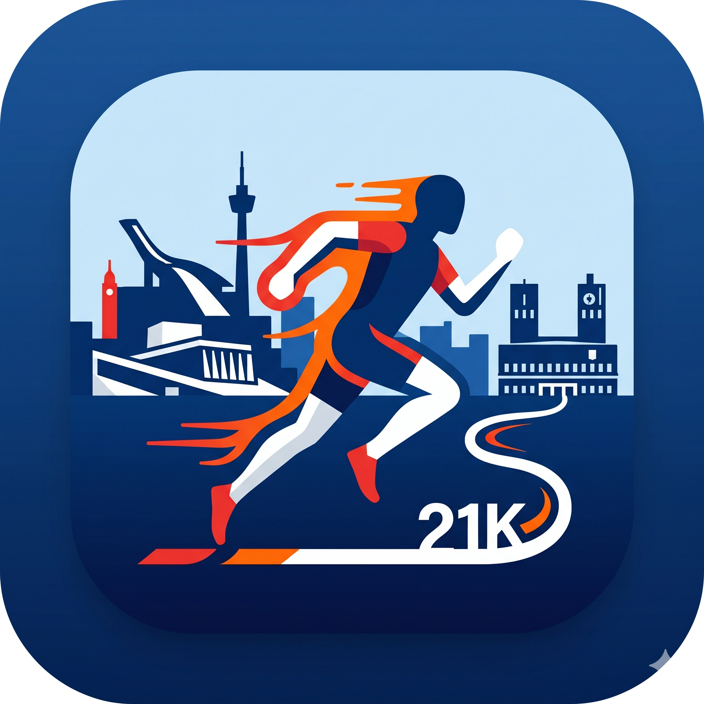

<div align="center">
  
  
  # Oslo Halvmaraton - Treningsplanlegger

  Treningsprogram for Oslo halvmaraton (12. september 2026) basert på **norsk modell** (Marius Bakken) og dine Strava-data.
</div>

## 🎯 Mål

- **Løp:** Oslo Halvmaraton (21,1 km, 145m stigning)
- **Dato:** 12. september 2026
- **Metode:** Norsk modell (threshold-fokusert, periodisert)
- **Tilpasset:** Post-kneskade comeback + Grenada-periode (22. juni - 19. juli)

## 🚀 Kom i gang

### 1. Opprett virtuelt miljø (anbefalt)

```bash
# Opprett virtuelt miljø
python3 -m venv venv

# Aktiver virtuelt miljø
source venv/bin/activate  # Mac/Linux
# venv\Scripts\activate   # Windows
```

**Hvorfor venv?** Isolerer prosjektets pakker fra system-Python og andre prosjekter, unngår versjonskonflikter.

### 2. Installer Python-pakker

```bash
pip install -r requirements.txt
```

### 3. Sett opp Strava API

Følg instruksjonene i [STRAVA_SETUP.md](STRAVA_SETUP.md):

1. Opprett en Strava API-app på [strava.com/settings/api](https://www.strava.com/settings/api)
2. Lag en `.env` fil med dine API-nøkler:

```bash
STRAVA_CLIENT_ID=ditt_client_id
STRAVA_CLIENT_SECRET=ditt_client_secret
```

### 4. Test Strava-tilkobling

```bash
python strava_auth.py
```

Dette vil åpne en nettleser for autentisering. Logg inn og godkjenn tilgang.

### 5. Hent og analyser treningsdata

```bash
python fetch_strava_data.py
```

Dette viser en oppsummering av din nåværende treningsstatus.

### 6. Generer treningsplan

```bash
python training_plan.py
```

Dette lager et detaljert ukentlig treningsprogram basert på:
- Dine Strava-data
- Norsk modell prinsipper
- Grenada-perioden med varme/bakker
- Opptrapping mot 12. september

**NY:** Hver økt inkluderer nå:
- 🔥 **Oppvarming** for nøkkeløkter
- 🚴 **Sykkelalternativ** (hvis kne betendt/hovent)

### 7. Synkroniser til Google Calendar (valgfritt)

```bash
python google_calendar_sync.py
```

Første gang må du sette opp Google Calendar API - se [GOOGLE_CALENDAR_SETUP.md](GOOGLE_CALENDAR_SETUP.md).

Dette vil:
- Slette gamle treningsøkter fra kalenderen
- Opprette nye økter med alle detaljer
- Sette påminnelser (1 time før)
- Automatisk oppdatere hvis du endrer planen

## 📊 Hva programmet gjør

### Analyserer din nåværende form
- Siste 4 og 12 ukers treningsvolum
- Gjennomsnittlig pace og stigning
- Lengste løp og raskeste pace
- 2TL Jeløya-resultat

### Beregner treningssoner
Basert på norsk modell:
- **Rolig:** Grunntrening (60-70% av ukevolum)
- **Terskel:** Laktatterskel-trening (2x per uke)
- **Tempo:** Litt raskere enn terskel
- **Intervaller:** 5k-pace (periodisk)
- **Langtur:** Lørdag, 30-35% av ukevolum

### Periodiserer treningen
1. **Uke 1-4:** Oppbygging (gradvis økning)
2. **Uke 5-8:** Base/volum (inkl. Grenada-tilpasning)
3. **Uke 9-12:** Peak (høy kvalitet)
4. **Uke 13-14:** Nedtrapping

### Estimerer tidsmål
Tar hensyn til:
- Nåværende form
- Antatt progresjon
- Oslo halvmaraton høydeprofil (145m)
- Comeback etter kneskade (konservativ faktor)

## 🏃 Norsk modell prinsipper

Basert på Marius Bakkens filosofi:

1. **Double threshold:** 2x terskeltrening per uke (tirsdag + torsdag)
2. **Lang rolig:** Langtur lørdag (30-35% av ukevolum)
3. **Rolig grunntrening:** 60-70% av treningen skal være rolig
4. **Periodisering:** Oppbygging → volum → kvalitet → nedtrapping
5. **Restitusjon:** Hviledag eller lett jogg mellom harde økter

### Ukesstruktur
- **Mandag:** Rolig
- **Tirsdag:** Terskelintervaller (f.eks. 3x10 min)
- **Onsdag:** Rolig
- **Torsdag:** Tempo/terskel (f.eks. 30-40 min kontinuerlig)
- **Fredag:** Hvile/lett
- **Lørdag:** Langtur
- **Søndag:** Rolig/hvile

## 🌴 Grenada-tilpasning (22. juni - 19. juli)

Under ferien i Grenada:
- Redusert volum (ca. 70% av normalt)
- Tren tidlig morgen (unngå varme)
- Fokus på kvalitet fremfor volum
- Bakkeintervaller i kupert terreng
- Ekstra hydrasjon og elektrolytter
- Alternativ: Svømming for krysstrening

## 📈 Output-filer

Programmet genererer:
- `strava_activities.csv` - Alle aktiviteter fra Strava
- `treningsplan_oslo_halvmaraton.csv` - Detaljert ukesplan (inkl. oppvarming og sykkelalternativ)
- `treningsprogresjon.png` - Graf over historisk progresjon
- `treningsplan_periodisering.png` - Periodiseringsplan

## ⚠️ Viktige hensyn

1. **Kneskade:** Post-operasjon (korsbånd, menisk, brusk). Lytt til kroppen!
2. **Terrengtoleanse:** Begrenset terrengtrening → positiv split på 2TL
3. **Grenada:** Varmt og kupert → tilpass intensitet
4. **Konservativ tilnærming:** Bedre å være 100% frisk på startstreken

## 🔄 Oppdatere planen

For å oppdatere planen basert på ny Strava-data:

```bash
python training_plan.py
```

Kjør dette hver uke for å justere basert på faktisk progresjon.

## 📚 Referanser

- [Oslo Maraton](https://oslomaraton.no)
- [Marathon Index - Oslo Half Course](https://marathon-index.com/races/oslo-half-marathon/course/)
- Marius Bakken - Norsk modell / threshold-basert trening
- Stravalib dokumentasjon: [stravalib.readthedocs.io](https://stravalib.readthedocs.io/)

## 🆘 Feilsøking

### "STRAVA_CLIENT_ID ikke satt"
- Sjekk at du har opprettet `.env` fil med korrekte API-nøkler
- Se [STRAVA_SETUP.md](STRAVA_SETUP.md)

### "Ingen aktiviteter funnet"
- Sjekk at du har gitt appen tilgang til å lese aktiviteter
- Prøv å autentisere på nytt: `python strava_auth.py`

### Importfeil
- Installer pakker: `pip install -r requirements.txt`

---

**Lykke til med treningen! 🏃‍♂️🇳🇴**
